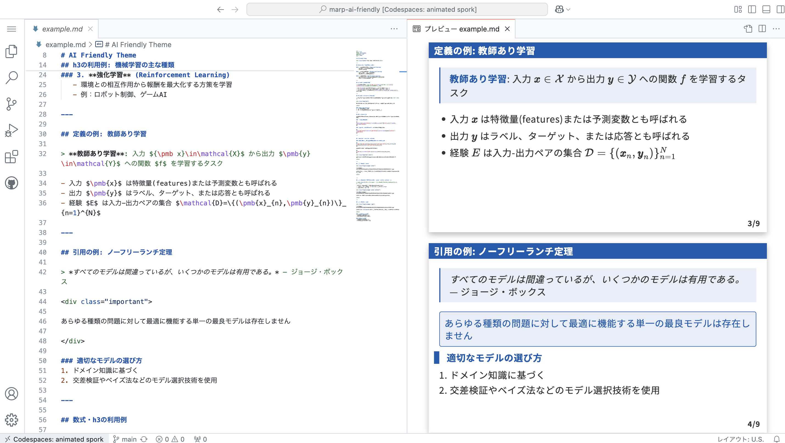

# Marp `ai-friendly` theme

* A fork of https://github.com/kaisugi/marp-theme-academic
* Design is highly insipired by [プレゼンデザイン (design4u.jp)](https://ppt.design4u.jp/)
* Contents and images in `example.md` are from [Murphy's ML book](https://probml.github.io/pml-book/book1.html)

## Usage

**Just copy a single markdown file to get started.** Each markdown file contains the theme version in its frontmatter and full setup instructions (theme download, VSCode configuration, and CLI build commands) in an HTML comment block.

Ask your AI coding assistant (Claude Code, Cursor, GitHub Copilot, etc.) to read the markdown file — it will automatically handle theme download, VSCode setup, and PDF/HTML builds.

### GitHub Codespace

You can also clone this repo and open with GitHub Codespace:

## TODOs

* [x] Enhance code block visualizations
* [x] Enhance table visualizations
* [ ] pass image ratio to llm `file xxx.jpg | grep -o '[0-9]\{2,5\}x[0-9]\{2,5\}' | tail -n 1 | awk -Fx '{print $1 / $2}'`
