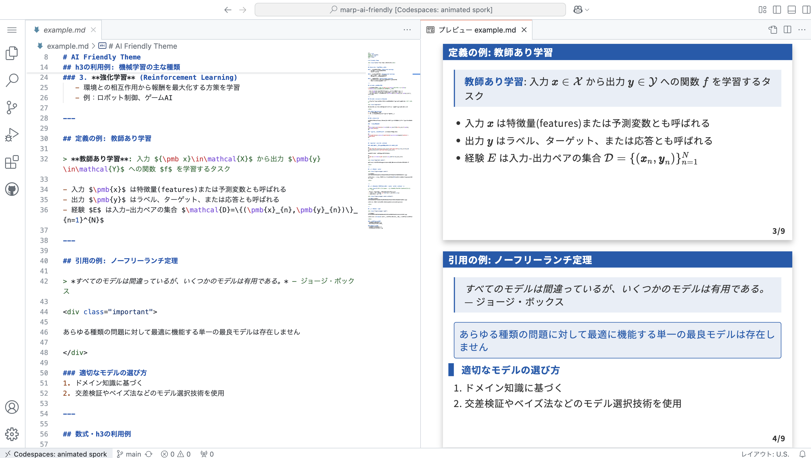

# Marp `ai-friendly` theme

* A fork of https://github.com/kaisugi/marp-theme-academic
* Design is highly insipired by [プレゼンデザイン (design4u.jp)](https://ppt.design4u.jp/)
* Contents and images in `example.md` are from [Murphy's ML book](https://probml.github.io/pml-book/book1.html)


## Usage

**Just copy a single markdown file to get started.** Each markdown file contains setup instructions in an HTML comment block. Ask your AI coding assistant (Claude Code, Cursor, GitHub Copilot, etc.) to read the markdown file — it will handle theme download, VSCode setup, and PDF/HTML builds.

> Prompt example: `Read slide.md and run the setup commands in the HTML comment block.`

### Theme versioning

The theme version is specified via the `theme` property in the frontmatter:

```yaml
theme: ai_friendly      # latest (main branch)
theme: ai_friendly_v4   # pinned to v4
```

When a version is pinned (e.g., `ai_friendly_v4`), the theme CSS is fetched from the corresponding git tag. The CSS at each tag registers itself as `ai_friendly_vN` via `/* @theme ai_friendly_vN */`, so multiple versions can coexist.

### Release process

Run the Release workflow from GitHub Actions (or `gh workflow run release.yml -f version=vN`). The workflow automatically updates theme names in CSS/example.md, commits, tags, and creates a GitHub Release.

With Claude Code, you can also use the `/release` slash command.

### Obsidian Callouts

このテーマは [Obsidian Callout](https://help.obsidian.md/callouts) 構文を完全に再現する追加文法をサポートします (動的な折りたたみは静的描画のみ)。`setup.sh` が `marp.config.mjs` を配置し、Marp CLI/VSCode 拡張の双方で利用できます。

```markdown
> [!NOTE] タイトル
> 本文。**Markdown** や `code`、$E = mc^2$ も利用可能。
```

サポートするタイプ (エイリアスを含む):

| Type | Aliases |
|---|---|
| `note` | — |
| `abstract` | `summary`, `tldr` |
| `info` | — |
| `todo` | — |
| `tip` | `hint`, `important` |
| `success` | `check`, `done` |
| `question` | `help`, `faq` |
| `warning` | `caution`, `attention` |
| `failure` | `fail`, `missing` |
| `danger` | `error` |
| `bug` | — |
| `example` | — |
| `quote` | `cite` |

折りたたみ構文 `[!TYPE]+` / `[!TYPE]-` は受理されますが、本テーマでは静的に表示します (アニメーションなし)。未知のタイプは通常の blockquote として表示されます。

> [!NOTE]
> VSCode の Marp 拡張で Callout を有効化するには、Workspace Trust を許可してください (`marp.config.mjs` を読み込むため)。

### GitHub Codespace

You can also clone this repo and open with GitHub Codespace:




## TODOs

* [x] Enhance code block visualizations
* [x] Enhance table visualizations
* [ ] pass image ratio to llm `file xxx.jpg | grep -o '[0-9]\{2,5\}x[0-9]\{2,5\}' | tail -n 1 | awk -Fx '{print $1 / $2}'`
