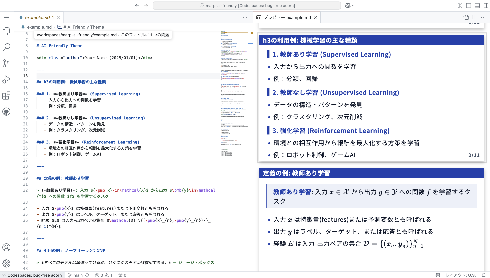

# Marp `ai-friendly` theme

* A fork of https://github.com/kaisugi/marp-theme-academic
* Design is highly insipired by [プレゼンデザイン (design4u.jp)](https://ppt.design4u.jp/)
* Contents and images in `example.md` are from [Murphy's ML book](https://probml.github.io/pml-book/book1.html)


## Usage 

1. add `.vscode/settings.json ` with the following content:
2. install marp VSCode extension.
3. open markdown file with VSCode.

```json:.vscode/settings.json
{
    "markdown.marp.themes": [
      "https://raw.githubusercontent.com/sotetsuk/marp-ai-friendly/refs/tags/v4/themes/ai_friendly.css",
    ]
}
```

or clone this repo and open with GitHub codespace:




## TODOs

* [x] Enhance code block visualizations
* [x] Enhance table visualizations
* [ ] pass image ratio to llm `file xxx.jpg | grep -o '[0-9]\{2,5\}x[0-9]\{2,5\}' | tail -n 1 | awk -Fx '{print $1 / $2}'`
