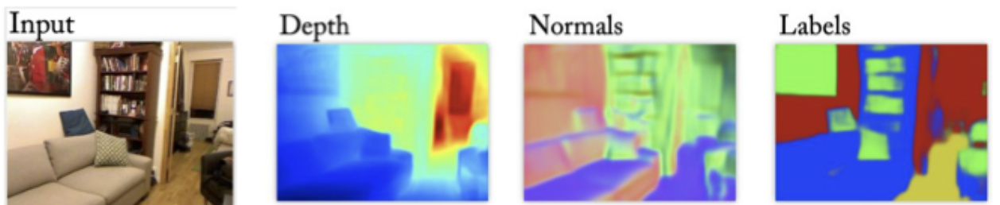
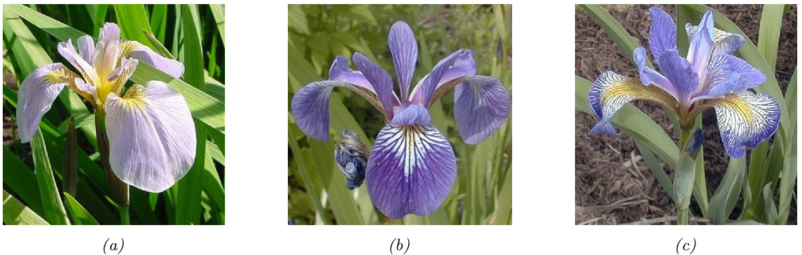
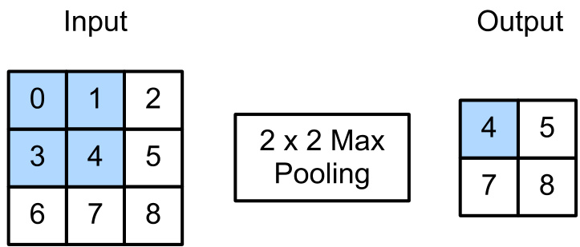

# 機械学習入門

Your Name (2025/01/01)

---

## h3の利用例: 機械学習の主な種類

### 1. **教師あり学習** (Supervised Learning)
   - 入力から出力への関数を学習
   - 例：分類、回帰

### 2. **教師なし学習** (Unsupervised Learning)
   - データの構造・パターンを発見
   - 例：クラスタリング、次元削減

### 3. **強化学習** (Reinforcement Learning)
   - 環境との相互作用から報酬を最大化する方策を学習
   - 例：ロボット制御、ゲームAI

---

## 定義の例: 教師あり学習

> **教師あり学習**: 入力 ${\pmb x}\in\mathcal{X}$ から出力 $\pmb{y}\in\mathcal{Y}$ への関数 $f$ を学習するタスク

- 入力 $\pmb{x}$ は特徴量(features)または予測変数とも呼ばれる
- 出力 $\pmb{y}$ はラベル、ターゲット、または応答とも呼ばれる
- 経験 $E$ は入力-出力ペアの集合 $\mathcal{D}=\{(\pmb{x}_{n},\pmb{y}_{n})\}_{n=1}^{N}$

---

## 引用の例: ノーフリーランチ定理

> *すべてのモデルは間違っているが、いくつかのモデルは有用である。* — ジョージ・ボックス

あらゆる種類の問題に対して最適に機能する単一の最良モデルは存在しません

### 適切なモデルの選び方
1. ドメイン知識に基づく
2. 交差検証やベイズ法などのモデル選択技術を使用

---

## 数式・h3の利用例

教師あり学習の目標は、任意の入力に対してラベルを確実に予測するモデルを自動的に作成すること

### 一般的な損失関数

$$
\mathcal{L}(\pmb{\theta})=\frac{1}{N}\sum_{n=1}^{N}\ell(y_{n},f(\pmb{x}_{n};\pmb{\theta}))
$$

### モデルトレーニングの目標: **経験的リスク最小化**

$$
\hat{\pmb\theta}=\underset{\pmb\theta}{\operatorname{argmin}}\mathcal L(\pmb\theta)
$$

---

## `important` の利用例: 相互相関

### 畳み込みと似た操作で、重みベクトルを反転させない

$$
[{\pmb w}*{\pmb x}](i)=w_{-L}x_{i-L}+\cdot\cdot\cdot+w_{-1}x_{i-1}+w_{0}x_{i}+w_{1}x_{i+1}+\cdot\cdot\cdot+w_{L}x_{i+L}
$$

簡略化すると（負のインデックスを排除）:

$$
[{\pmb w}\circledast{\pmb x}](i)=\sum_{u=0}^{L-1}w_{u}x_{i+u}
$$

ディープラーニングの文献では通常、**畳み込み**は**相互相関**を意味します

---

## 画像配置の例 `center`

**図14.31**: マルチタスク密予測問題の図解。[EF15]の図1より。Rob Fergus氏の許可を得て使用。

---

## 画像配置の例（ テキストががある `center` の場合 `withtext` ）

> 分類問題: 出力空間はクラスの集合 $\mathcal{Y}=\{1,2,...,C\}$

- クラス = 順序付けられていない相互排他的なラベル
- 二項分類: $C = 2$、$y \in \{0,1\}$ または $\{-1,+1\}$
- 多クラス分類: $C > 2$

**図1.2**: アヤメの花の3種類（Setosa、Versicolor、Virginica）

---

## 画像配置の例 `right`

  

  
**図14.12**: $2\times2$ フィルターとストライド1を使用したマックスプーリングの図解

### マックスプーリング
- 各領域内の最大値を出力
- エッジや特徴の存在を強調

### 平均プーリング
- 各領域内の平均値を出力
- 全体的な特徴を捉える傾向

